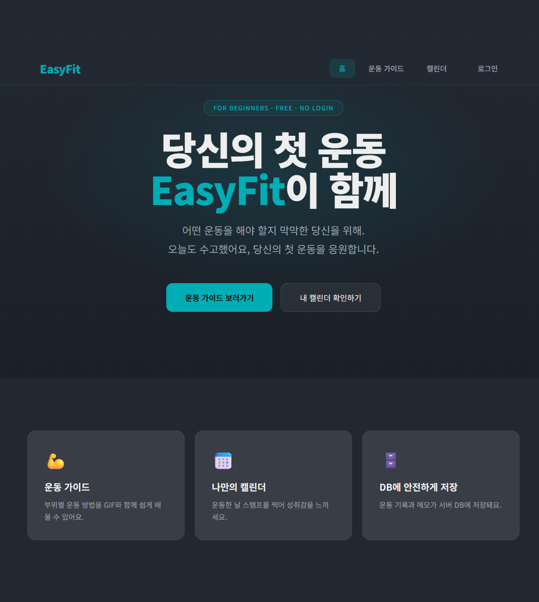
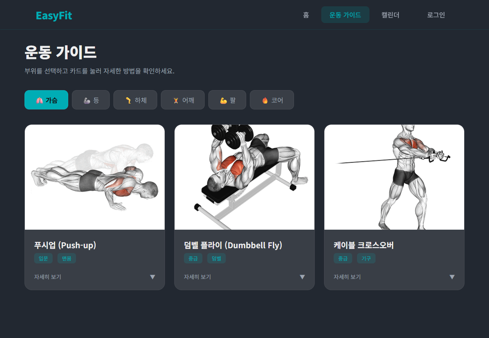
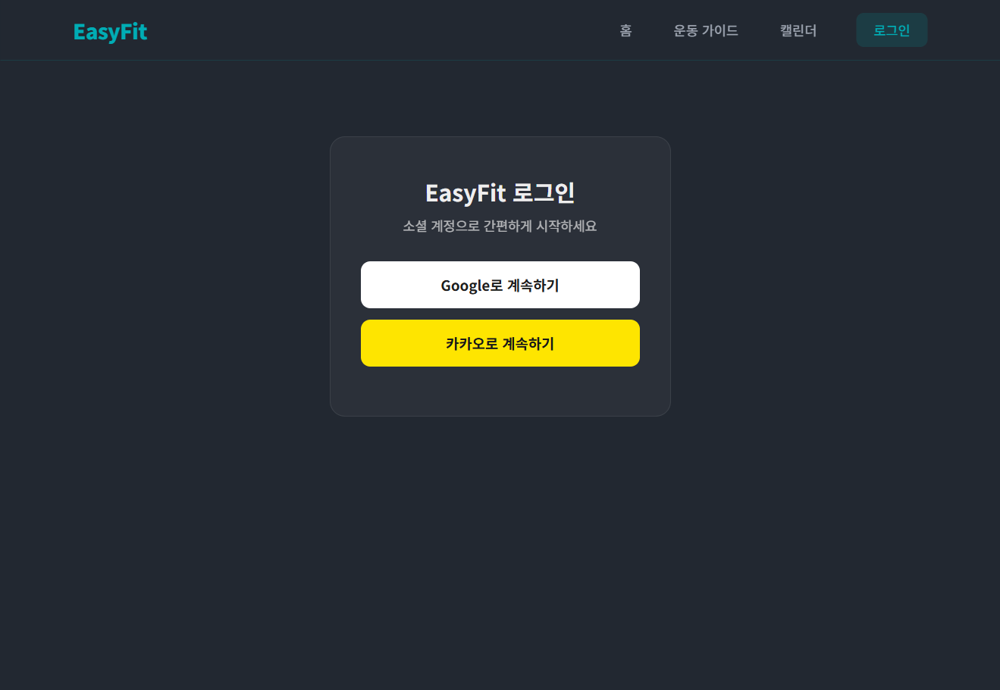
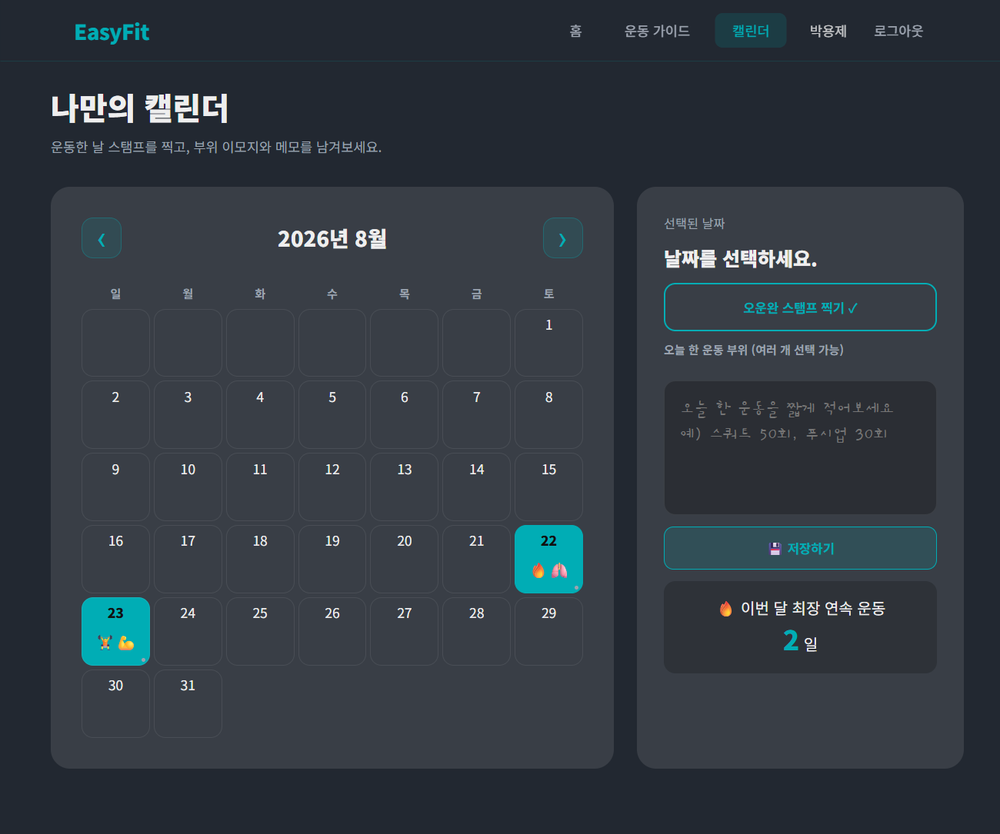

## 📸 스크린샷

| 홈 | 운동 가이드 |
|---|---|
|  |  |

| 로그인 | 캘린더 |
|---|---|
|  |  |

## 📌 주요 기능

- **운동 가이드**: 부위별(가슴/등/어깨/팔/하체 등) 운동 목록과 자세, 타겟 근육, 주의사항 안내
- **캘린더 기록**: 날짜별 운동 여부를 도장(스탬프)으로 표시하고, 메모를 남길 수 있는 캘린더
- **운동 부위 태깅**: 캘린더에 그날 수행한 운동 부위를 이모지로 표시
- **소셜 로그인**: Google / Kakao OAuth2 로그인 지원

## 🛠 기술 스택

| 분류 | 기술 |
|---|---|
| Language | Java 21 |
| Framework | Spring Boot 4.1 |
| Data Access | Spring Data JPA, Hibernate |
| Template Engine | Thymeleaf |
| Database | MySQL |
| Security | Spring Security, OAuth2 Client (Google, Kakao) |
| Build Tool | Gradle |
| ETC | Lombok |

## 🚀 실행

🔗 https://easy-fit-xxxx.onrender.com
